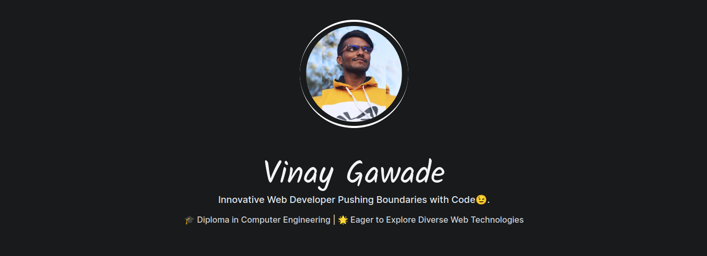

<div align="center">
  
  <br>
  
  
  
  
</div>

## Tools Used

* **Framework**: [Next.js](https://nextjs.org)
* **Styling**: [Tailwind CSS](https://tailwindcss.com)
* **Content**: [MDX](https://github.com/mdx-js/mdx)
* **Animations**: [Framer Motion](https://framer.com/motion)
* **Deployment**: [Vercel](https://vercel.com)
* **Icons**: [React Icons](https://react-icons.github.io/react-icons)
* **Plugins**: [rehype](https://github.com/rehypejs/rehype)
* **Analytics**: [Google Analytics](https://analytics.google.com/analytics/web)
* [SWR](https://swr.vercel.app)
* [Email.js](https://www.emailjs.com)
* [React Toastify](https://github.com/fkhadra/react-toastify)
* [Spotify API](https://developer.spotify.com/documentation/web-api)
* [Google Analytics Data API](https://developers.google.com/analytics/devguides/reporting/data/v1)

## Run Locally

Clone the project:

```bash
git clone https://github.com/vinugawade/vinux.in.git
```

Go to the project directory:

```bash
cd vinux.in
```

Install dependencies:

```bash
yarn
# or
npm install
```

Start the server:

```bash
yarn dev
# or
npm run dev
```

The server should now be running on [localhost:3000](http://localhost:3000).

> Note: I am using yarn, but you can use pnpm or npm as well. Ensure you have populated the `.env.local` file with the correct values.

## Setting up the Environment

1. Rename [`.env.example`](/.env.example) to `.env.local`.
2. Modify the `.env.local` file with the respective values for the following properties:

### Configure Email.js

* `NEXT_PUBLIC_YOUR_SERVICE_ID`: This value can be obtained from the [Admin Panel](https://dashboard.emailjs.com/admin) of [emailjs.com](https://emailjs.com). Follow these steps:

  * Click on the **Add Service** button:

     

  * Select the email provider you want to use, e.g., **Gmail**:

     

  * Connect your Gmail account and complete the necessary steps.
  * Once connected, click on **Create Service** and copy the **Service ID**.
  * Add the Service ID to the `.env.local` file: `NEXT_PUBLIC_YOUR_SERVICE_ID=<Your Service ID>`

### Configure Email.js Template

* `NEXT_PUBLIC_YOUR_TEMPLATE_ID`: To get the Template ID, go to the [Email Templates](https://dashboard.emailjs.com/admin/templates) section and click on **Create New Template**:

   

  * Customize your email template and save it.
  * After saving, you will see the Template ID in the URL. Copy this ID.
  * Add the Template ID to the `.env.local` file: `NEXT_PUBLIC_YOUR_TEMPLATE_ID=<Your Template ID>`

### Configure Google Analytics

* `NEXT_PUBLIC_GA_MEASUREMENT_ID`: To use Google Analytics, follow this [guide](https://support.google.com/analytics/answer/9539598?hl=en) to obtain your Google Analytics ID, also known as Measurement ID.
* Add the Measurement ID to the `.env.local` file: `NEXT_PUBLIC_GA_MEASUREMENT_ID=<Your Measurement ID>`

### Configure Spotify Integration

* Spotify integration requires three environment variable values:

  * `SPOTIFY_CLIENT_ID`: Follow this [blog](https://j471n.in/blogs/spotify-api-nextjs) to get the Client ID.
  * `SPOTIFY_CLIENT_SECRET`: Follow the same blog to get the Client Secret.
  * `SPOTIFY_REFRESH_TOKEN`: Again, follow the blog to get the Refresh Token.
  * Add these variables to the `.env.local` file with their respective values.

### Configure Google Analytics Data API

* `GA_PROPERTY_ID`: Follow this [blog](https://j471n.in/blogs/google-analytics-data-api) to obtain the Property ID for the Google Analytics Data API.
* `GA_CLIENT_EMAIL`: Refer to the same blog to get the Client Email.
* `GA_PRIVATE_KEY`: Follow the instructions in the blog to obtain and add the Private Key.
* Add these variables to the `.env.local` file.

After setting up the environment variables, you are ready to run the application!

## Screenshots & Demo
